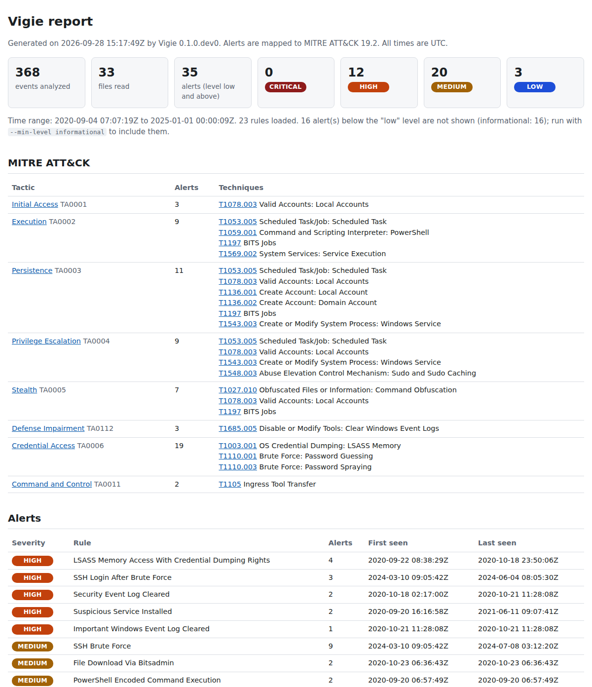

# Vigie

Vigie is an open source blue team tool that reads Windows and Linux logs,
runs Sigma detection rules on them and writes a report an analyst can read:
alerts ranked by severity, mapped to MITRE ATT&CK, with the events behind each
one and a timeline.

It is small enough to read in an afternoon, and built with the care a
detection tool needs (every rule tested with positive and negative cases,
known limits written down).

## What it does

- **Reads** Windows event logs (`.evtx`: Security, System, Sysmon, PowerShell),
  Windows events exported as JSON lines (the format of the OTRF
  Security-Datasets, `.json` or `.zip`) and Linux `auth.log` / `secure` files
  (classic syslog or RFC 3339, `.gz` rotated files, OpenSSH 9.8+ `sshd-session`).
  EVTX and auth.log files are recognized by their content, whatever their name;
  JSON exports need a `.json`, `.jsonl` or `.zip` extension.
- **Detects** with 23 Sigma rules evaluated by its own engine, including Sigma
  v2 correlation rules: brute force, password spraying, "successful login right
  after a brute force".
- **Maps** every alert to MITRE ATT&CK 19.2 tactics and techniques, offline.
- **Reports** in self-contained HTML, Markdown and JSON: summary, ATT&CK
  coverage, alerts with their rule, author and evidence, timeline, and what was
  read, skipped or rejected.

## Report preview



Full example: [`docs/example-report.md`](docs/example-report.md) (the HTML
version is [`docs/example-report.html`](docs/example-report.html)). It was
produced from the synthetic auth.log files and the OTRF excerpts of
`tests/fixtures`.

## Installation

Vigie needs Python 3.10 or later.

```bash
git clone https://github.com/Bouliw/vigie.git
cd vigie
python3 -m venv .venv
. .venv/bin/activate
pip install .
```

Runtime dependencies: `evtx` (EVTX decoding, Rust wheels), `PyYAML` and `Jinja2`.

## Usage

```bash
vigie analyze ./logs -o ./report
```

```text
Read 368 events from 33 file(s), 5 parser warning(s) listed in the report. 23 rules loaded.
Alerts: 12 high, 20 medium, 3 low (16 below low not shown).
Report: report/report.html, report/report.md
```

| Option | Meaning |
|---|---|
| `-o, --output DIR` | Folder for the report files (default `./vigie-report`) |
| `--format html,md,json` | Output formats (default `html,md`) |
| `--min-level LEVEL` | Lowest severity shown: `informational`, `low` (default), `medium`, `high`, `critical`. Hidden alerts are still counted. |
| `--full-timeline` | Put every event in the timeline, not only those behind the alerts |
| `--timeline-limit N` | Most events listed in the timeline (default 5000); the report and the summary say how many were left out |
| `--rules PATH` | Use these Sigma rules (file or folder, repeatable) instead of the shipped ones |
| `--year YEAR` | Year of the first line of classic syslog files, which carry no year; later lines follow on, moving to the next year when the month goes back (default: guessed from the file's modification date) |
| `--tz ZONE` | Time zone of classic syslog lines, for example `Europe/Berlin` (default `UTC`) |

`vigie rules` lists the rules with their level and ATT&CK techniques.
`python -m vigie` works too.

## Detection rules and ATT&CK mapping

| OS | Rule | Level | Log source | MITRE ATT&CK | Origin |
|---|---|---|---|---|---|
| Linux | SSH Login After Brute Force | high | correlation (temporal_ordered) | [T1078.003](https://attack.mitre.org/techniques/T1078/003) Valid Accounts: Local Accounts<br>[T1110.001](https://attack.mitre.org/techniques/T1110/001) Brute Force: Password Guessing | Vigie |
| Linux | Local User Account Created | medium | auth.log | [T1136.001](https://attack.mitre.org/techniques/T1136/001) Create Account: Local Account | Vigie |
| Linux | SSH Brute Force | medium | correlation (event_count) | [T1110.001](https://attack.mitre.org/techniques/T1110/001) Brute Force: Password Guessing | Vigie |
| Linux | SSH Password Spraying | medium | correlation (value_count) | [T1110.003](https://attack.mitre.org/techniques/T1110/003) Brute Force: Password Spraying | Vigie |
| Linux | SSH Failed Password * | low | auth.log (sshd) | [T1110](https://attack.mitre.org/techniques/T1110) Brute Force | Vigie |
| Linux | Sudo Authentication Failure | low | auth.log (sudo) | [T1548.003](https://attack.mitre.org/techniques/T1548/003) Abuse Elevation Control Mechanism: Sudo and Sudo Caching | Vigie |
| Linux | SSH Login Accepted | informational | auth.log (sshd) | [T1021.004](https://attack.mitre.org/techniques/T1021/004) Remote Services: SSH | Vigie |
| Windows | Hidden User Account Created | high | Security 4720 | [T1036.010](https://attack.mitre.org/techniques/T1036/010) Masquerading: Masquerade Account Name<br>[T1136.001](https://attack.mitre.org/techniques/T1136/001) Create Account: Local Account<br>[T1136.002](https://attack.mitre.org/techniques/T1136/002) Create Account: Domain Account<br>[T1564.002](https://attack.mitre.org/techniques/T1564/002) Hide Artifacts: Hidden Users | SigmaHQ |
| Windows | Important Windows Event Log Cleared | high | System 104 | [T1685.005](https://attack.mitre.org/techniques/T1685/005) Disable or Modify Tools: Clear Windows Event Logs | SigmaHQ |
| Windows | LSASS Memory Access With Credential Dumping Rights | high | Sysmon 10 | [T1003.001](https://attack.mitre.org/techniques/T1003/001) OS Credential Dumping: LSASS Memory | SigmaHQ |
| Windows | Security Event Log Cleared | high | Security 1102 | [T1685.005](https://attack.mitre.org/techniques/T1685/005) Disable or Modify Tools: Clear Windows Event Logs | SigmaHQ |
| Windows | Suspicious Service Installed | high | System 7045 | [T1543.003](https://attack.mitre.org/techniques/T1543/003) Create or Modify System Process: Windows Service<br>[T1569.002](https://attack.mitre.org/techniques/T1569/002) System Services: Service Execution | SigmaHQ |
| Windows | File Download Via Bitsadmin | medium | Sysmon 1 / Security 4688 | [T1105](https://attack.mitre.org/techniques/T1105) Ingress Tool Transfer<br>[T1197](https://attack.mitre.org/techniques/T1197) BITS Jobs | SigmaHQ |
| Windows | File Download Via Certutil | medium | Sysmon 1 / Security 4688 | [T1105](https://attack.mitre.org/techniques/T1105) Ingress Tool Transfer | SigmaHQ |
| Windows | File Download Via Desktopimgdownldr | medium | Sysmon 1 / Security 4688 | [T1105](https://attack.mitre.org/techniques/T1105) Ingress Tool Transfer | SigmaHQ |
| Windows | Kerberos Password Spraying From Single Source | medium | correlation (value_count) | [T1110.003](https://attack.mitre.org/techniques/T1110/003) Brute Force: Password Spraying | Vigie |
| Windows | PowerShell Encoded Command Execution | medium | Sysmon 1 / Security 4688 | [T1027.010](https://attack.mitre.org/techniques/T1027/010) Obfuscated Files or Information: Command Obfuscation<br>[T1059.001](https://attack.mitre.org/techniques/T1059/001) Command and Scripting Interpreter: PowerShell | SigmaHQ |
| Windows | PsExec-Like Service Installed | medium | System 7045 | [T1569.002](https://attack.mitre.org/techniques/T1569/002) System Services: Service Execution | SigmaHQ |
| Windows | Suspicious Scheduled Task Created | medium | Security 4698 | [T1053.005](https://attack.mitre.org/techniques/T1053/005) Scheduled Task/Job: Scheduled Task | SigmaHQ |
| Windows | Windows Logon Brute Force From Single Source | medium | correlation (event_count) | [T1110.001](https://attack.mitre.org/techniques/T1110/001) Brute Force: Password Guessing<br>[T1110.003](https://attack.mitre.org/techniques/T1110/003) Brute Force: Password Spraying | Vigie |
| Windows | Kerberos Authentication Failure * | low | Security 4768, 4771 | [T1110](https://attack.mitre.org/techniques/T1110) Brute Force | Vigie |
| Windows | User Account Created | low | Security 4720 | [T1136.001](https://attack.mitre.org/techniques/T1136/001) Create Account: Local Account<br>[T1136.002](https://attack.mitre.org/techniques/T1136/002) Create Account: Domain Account | SigmaHQ |
| Windows | Windows Failed Logon * | low | Security 4625 | [T1110](https://attack.mitre.org/techniques/T1110) Brute Force | Vigie |

`*` These rules only feed a correlation (a single failed password is noise), so
they raise no alert of their own. SSH Login Accepted is informational context,
hidden by the default `--min-level low`.

Twelve rules are adapted from [SigmaHQ](https://github.com/SigmaHQ/sigma). Each
keeps its original authors, a link to the original rule and `license: DRL-1.1`,
and the report credits the rule author in every alert, as the Detection Rule
License requires. Each rule file explains what was changed and why.

## How it works

```text
logs ──▶ collect ──▶ parsers ──▶ events ──▶ Sigma engine ──▶ correlations ──▶ alerts ──▶ report
         (format      (EVTX,     (UTC,      (rules routed    (per group,              (HTML, MD,
         detection)   OTRF JSON, one model) by log source)   sliding window)          JSON)
                      auth.log)
```

- **Parsers** turn every format into one event model with UTC timestamps. They
  never stop on bad data: a corrupted record becomes a warning in the report.
  The auth.log parser reads the source address from the end of each line,
  because the client chooses the user name and could otherwise insert a fake
  address.
- **The Sigma engine** compiles each rule once: field modifiers (`contains`,
  `endswith`, `re`, `cidr`, `windash`...), conditions (`1 of selection_*`,
  `not filter`), log source routing (the `process_creation` category covers
  Sysmon 1 and Security 4688). A rule using an unsupported feature is rejected
  with the reason, never silently ignored.
- **Correlations** (`event_count`, `value_count`, `temporal`,
  `temporal_ordered`) count or chain matches per group within a time window.
- **ATT&CK data** is a 117 KB extract of the official STIX bundle, regenerated
  with `tools/build_attack_data.py`.

## How Vigie compares

Mature, open source tools already do this job, and do it faster and on more
data. Use them for real investigations:

| Tool | What it is | What it does better than Vigie |
|---|---|---|
| [Hayabusa](https://github.com/Yamato-Security/hayabusa) | Windows event log fast forensics timeline generator and threat hunting tool, in Rust (AGPL-3.0) | Multi-threaded speed on large sets of logs, full Sigma support (v2 correlations included) with a large curated ruleset, CSV/JSON/JSONL timelines for Timeline Explorer, Elastic or Timesketch, live collection through Velociraptor |
| [Chainsaw](https://github.com/WithSecureLabs/chainsaw) | First-response hunting through Windows forensic artefacts, in Rust (GPL-3.0) | Much more than event logs (Shimcache execution timelines enriched with Amcache, SRUM analysis, MFT and registry hive dumps), fast keyword and regex search, Sigma plus its own rule format |
| [Zircolite](https://github.com/wagga40/Zircolite) | Standalone Sigma detection tool in Python (LGPL-3.0), backed by SQLite | Native SigmaHQ rulesets converted with pySigma, many input formats (EVTX, auditd, Sysmon for Linux, CSV, XML, JSON), exports to Splunk, Elastic, Timesketch or ATT&CK Navigator, an offline mini GUI |

Why Vigie exists anyway:

- **To show how detection works, end to end.** The Sigma evaluator,
  correlation windows, log source routing and parsers fit in under 2,000 lines
  of commented Python (`src/vigie/sigma` and `src/vigie/parsers`), instead of
  being delegated to a backend or a library.
- **Tested detections.** Every rule has positive and negative cases: Windows
  rules on public attack samples (plus synthetic in-memory events for edge
  cases), Linux rules on hand-written auth.log files flagged as synthetic, since
  no public dataset suits them. A test fails if a rule fires on any file where
  it should not. The known gaps are written in the rules and in `tests/rules/cases.yaml`.
- **Linux auth.log.** Vigie reads the plain-text `auth.log` of Linux servers
  (sshd, sudo, su, useradd) and correlates SSH brute forces, password spraying
  and logins that follow them.
- **A report for people.** One page that answers "what happened, how bad, which
  ATT&CK technique, what is the evidence", rather than a table meant for
  another tool.

## Tests

```bash
pip install -e ".[dev]"
pytest
ruff check . && ruff format --check .
```

- **Test data** comes only from public datasets (EVTX-ATTACK-SAMPLES, OTRF
  Security-Datasets), plus synthetic Linux logs and synthetic in-memory Windows
  events, clearly marked as such. Sources, licenses and hashes are listed in
  [`tests/fixtures/README.md`](tests/fixtures/README.md).
- **Rule tests** (`tests/rules/`): exact counts on positive fixtures, zero on
  negatives, no rule firing anywhere unexpected, pinned correlation
  parameters, ATT&CK tags and license attribution checks.
- **End-to-end test**: `vigie analyze` on the whole fixture folder.

CI runs the suite on Python 3.10 to 3.13.

## Limitations

- Vigie implements a subset of Sigma: no `base64`/`utf16` modifiers, no
  `fieldref`, no placeholders, correlation thresholds with `gt`/`gte` only.
  Rules using them are rejected with the reason.
- Supported log sources are listed in `src/vigie/sigma/logsource.py`:
  Windows Security, System, Application, Sysmon, PowerShell, Task Scheduler
  and Defender, and Linux auth.log.
- Everything runs in memory: fine for an investigation folder, not for months
  of logs from a whole company.
- Public data holds no slow or distributed Windows brute force, so the time
  windows of the Windows correlations are pinned by tests rather than proven on
  data.

## Development

```bash
python3 -m venv .venv
. .venv/bin/activate
pip install -e ".[dev]"
ruff check . && ruff format --check .
pytest
```

## License

Vigie's code is released under the [MIT License](LICENSE), with these exceptions:

- Detection rules adapted from [SigmaHQ](https://github.com/SigmaHQ/sigma), the
  files with `license: DRL-1.1` in `src/vigie/rules/`, are distributed under the
  [Detection Rule License 1.1](src/vigie/rules/LICENSE.DRL-1.1.md). They keep
  their original authors and a link to the original rule.
- `src/vigie/attack/data/enterprise_attack.json` is a reduced copy of MITRE
  ATT&CK, © The MITRE Corporation, reproduced under the
  [ATT&CK Terms of Use](src/vigie/attack/data/LICENSE-ATTACK.txt).
- Test data: `tests/fixtures/evtx/` holds unmodified EVTX-ATTACK-SAMPLES files
  under GPL-3.0, and `tests/fixtures/winjson/` holds excerpts of OTRF
  Security-Datasets under MIT. See [`tests/fixtures/README.md`](tests/fixtures/README.md).
